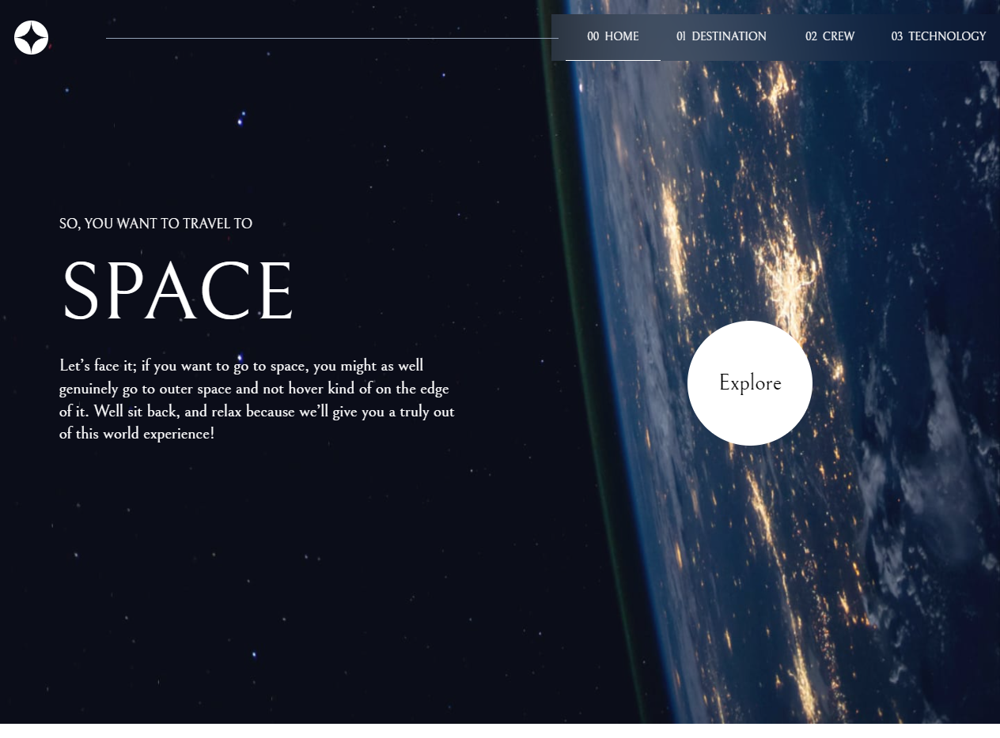

# Frontend Mentor - Space tourism website solution

This is a solution to the [Space tourism website challenge on Frontend Mentor](https://www.frontendmentor.io/challenges/space-tourism-multipage-website-gRWj1URZ3). Frontend Mentor challenges help you improve your coding skills by building realistic projects.

## Table of contents

- [Overview](#overview)
  - [The challenge](#the-challenge)
  - [Screenshot](#screenshot)
  - [Links](#links)
- [My process](#my-process)
  - [Built with](#built-with)
  - [What I learned](#what-i-learned)
  - [Continued development](#continued-development)
- [Author](#author)

## Overview

### The challenge

Users should be able to:

- View the optimal layout for each of the website's pages depending on their device's screen size
- See hover states for all interactive elements on the page
- View each page and be able to toggle between the tabs to see new information

### Screenshot

;

### Links

- Solution URL: [Solução no front-end mentor](https://www.frontendmentor.io/solutions/responsive-with-tailwind-HkuStEBX9)
- Live Site URL: [Live Site](https://vermillion-flan-8780cb.netlify.app)

## My process

### Built with

- Semantic HTML5 markup
- Mobile-first
- [Frame-motion](https://www.framer.com/motion/)
- [React-Router-Dom v6](https://reactrouter.com/docs/en/v6/getting-started/installation)
- [React](https://reactjs.org/) - JS library
- [Next.js](https://nextjs.org/) - React framework
- [Tailwind CSS](https://tailwindcss.com/docs/installation) - For styles

### What I learned

In this project I had the pleasure of getting to know tailwind, it's very powerful, I used the new version of react-router, v6 is awesome, I learned how to redirect with it and I got to know some libs to make alimations of the routes, the one I used in this project was the frame motion.
I also used this project to test some things, like creating a hook to perform requests.

```js
export function useFetch(url) {
  const [request, setRequest] = React.useState();
  const [error, setError] = React.useState();
  const [_, setIsLoading] = React.useState(false);

  React.useEffect(() => {
    setIsLoading(true);
    fetch(url)
      .then((res) => res.json())
      .then((req) => {
        setRequest(req);
      })
      .catch((e) => setError(e))
      .finally(() => setIsLoading(false));
  }, []);

  return {
    request,
    error,
  };
}

```

If you want more help with writing markdown, we'd recommend checking out [The Markdown Guide](https://www.markdownguide.org/) to learn more.

### Continued development

Every day that I program with React/Javascript I get more passionate about this fantastic technology, I intend to carry out many projects using it and all the power it provides to SPA development.

## Author

- Frontend Mentor - [@VDR-Crowley](https://www.frontendmentor.io/profile/VDR-Crowley)
- LinkedIn - [@VandoReis](https://www.linkedin.com/in/vando-dos-reis-261b23196/)
